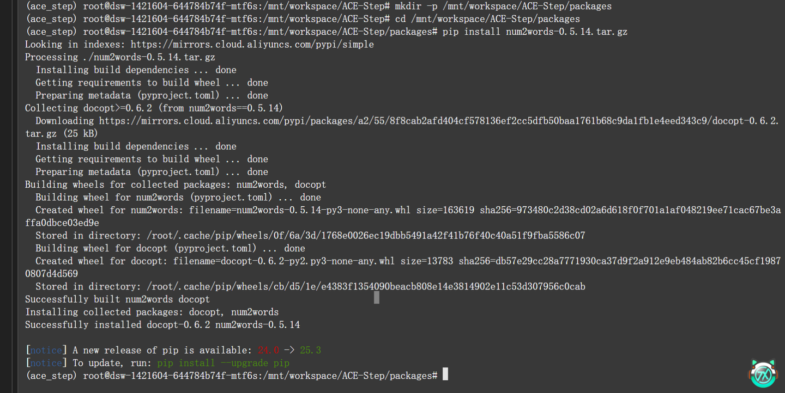
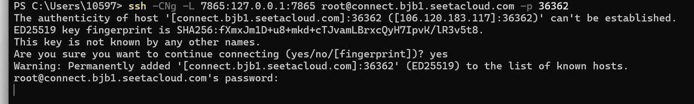
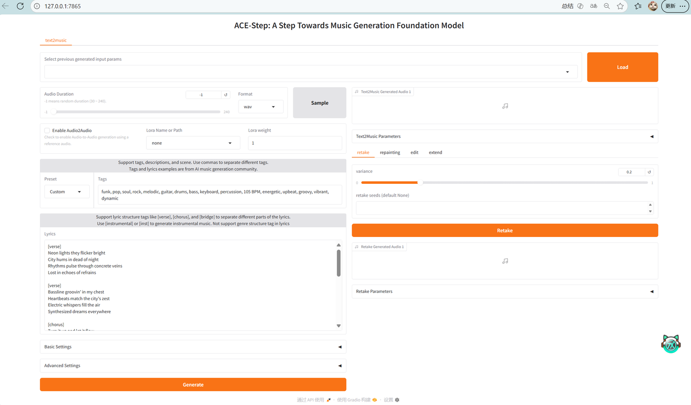
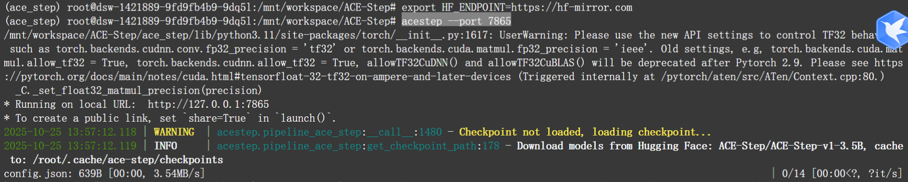
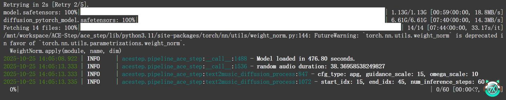
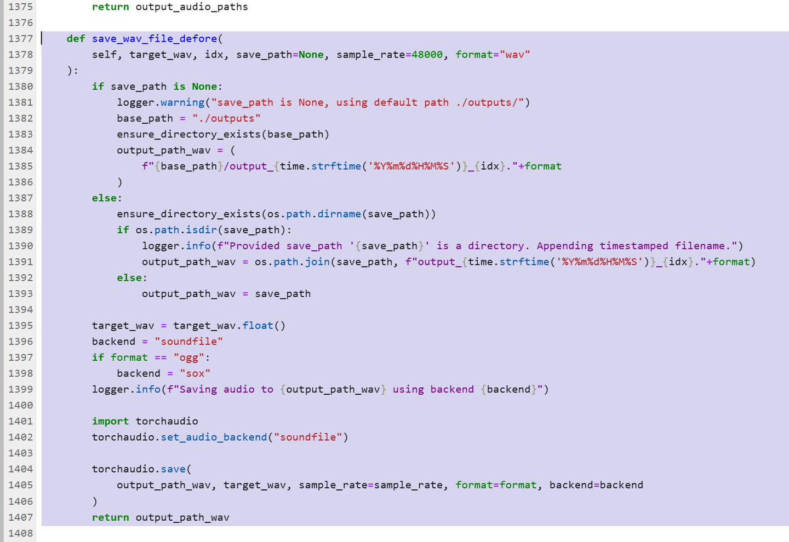
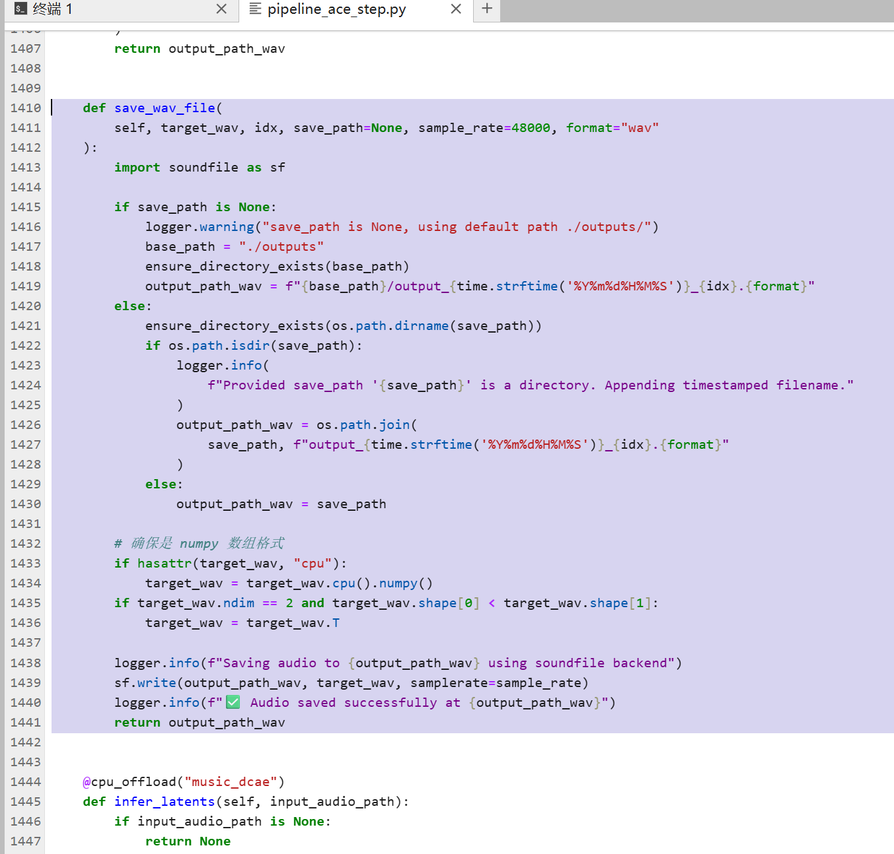
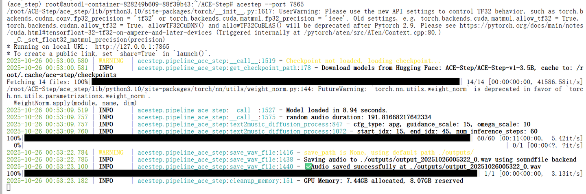
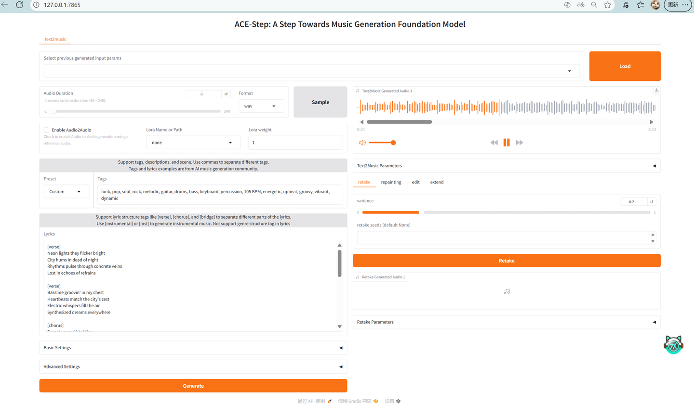
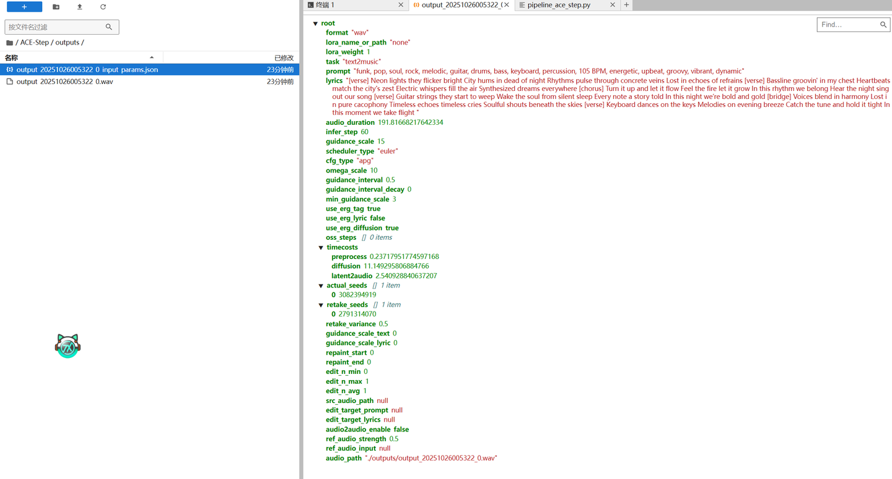

# 第 8 章 ACE-Step 部署使用教程

在 AutoDL 云服务器环境下，完整安装 ACE-Step（解决依赖问题、成功运行 Gradio 音乐生成界面，并修复音频保存失败等问题）。

ACE-Step: https://github.com/ace-step/ACE-Step

### 一、环境配置

```bash
git clone https://github.com/ace-step/ACE-Step.git
cd ACE-Step

python -m venv ace_step
source ace_step/bin/activate

pip3 install torch torchvision torchaudio --index-url https://download.pytorch.org/whl/cu126
pip install -e .
```

如果这里报错 **num2words 找不到可装版本**（由于 setup.py 限制 + 无法访问 PyPI）。

我们可以离线安装本地包。从 pypi 官网下载 num2words 上传到 AutoDL：`num2words-0.5.14.tar.gz`

新建目录：

```bash
mkdir -p /root/ACE-Step/packages
# 接下来把 num2words 压缩包手动上传到这个目录下
```

切换到虚拟环境并安装 num2words：

```bash
source ace_step/bin/activate
cd /root/ACE-Step/packages

pip install num2words-0.5.14.tar.gz
```

<div align=center>

</div>
<div align=center></div>

安装成功后，再重新执行：

```bash
pip install -e .
```

### 二、PowerShell 设置 SSH 端口转发

使用 AutoDL 我们无法通过公网访问 Gradio Web UI。

#### 1. 获取 SSH 登录信息

找到 AutoDL 提供的信息：

```
ssh -p xxxxx root@connect.bjb1.seetacloud.com
密码：xxxxxx
```

<div align=center>

</div>
<div align=center></div>

#### 2. 开启 SSH 本地端口转发（PowerShell）

在 Windows PowerShell 输入：

```bash
ssh -CNg -L 7865:127.0.0.1:7865 root@connect.bjb1.seetacloud.com -p xxxxx
```

<div align=center>

</div>
<div align=center></div>

输入密码 → 转发成功（无输出）。

### 三、运行 Demo（Gradio）

ACE-Step 默认需要从 Huggingface 下载模型，因此我们需要先设置国内镜像。

```bash
export HF_ENDPOINT=https://hf-mirror.com
```

运行 Gradio：

```bash
acestep --port 7865
```

在本地浏览器访问：`http://127.0.0.1:7865`

<div align=center>

</div>
<div align=center></div>

成功打开 ACE-Step Gradio Web UI。可以调整参数和 prompt 等等，完成后点击 Generate。这时 ACE-Step Pipeline 就开始运行了。

模型开始生成音乐，我们可以在终端看进度

<div align=center>

</div>
<div align=center></div>

第一次运行时自动下载模型权重。

<div align=center>

</div>
<div align=center></div>

生成音乐时日志中显示：`step: 9/60` 这表示 模型正在执行音乐生成的扩散过程（diffusion process），共 60 步推理，目前已完成第 9 步（约 15%）

表示扩散步骤进度，推荐使用 GPU。
使用 CPU 大概 60 ~ 70 分钟；GPU 需要 2 ~ 3 分钟。

---

### 四、如果保存音频文件时报 torchcodec 兼容性错误？

在保存音频阶段 `torchaudio.save()` 报错，原因：**torchcodec 尚未支持 torch 2.9 + cu126**，导致 `libtorchcodec.so` 加载失败。

**解决方法：强制绕过 torchcodec，使用 soundfile 保存**

由于 torchaudio 新版本已经移除 `set_audio_backend()` 方法，因此需要改为直接使用 `soundfile`。

编辑文件：

```
/root/ACE-Step/acestep/pipeline_ace_step.py
```

找到：

```
def save_wav_file(...)
```

<div align=center>

</div>
<div align=center></div>

将整个 `save_wav_file` 函数替换为：

<div align=center>

</div>
<div align=center></div>

```python
import soundfile as sf

def save_wav_file(
        self, target_wav, idx, save_path=None, sample_rate=48000, format="wav"
    ):
        import soundfile as sf

        if save_path is None:
            logger.warning("save_path is None, using default path ./outputs/")
            base_path = "./outputs"
            ensure_directory_exists(base_path)
            output_path_wav = f"{base_path}/output_{time.strftime('%Y%m%d%H%M%S')}_{idx}.{format}"
        else:
            ensure_directory_exists(os.path.dirname(save_path))
            if os.path.isdir(save_path):
                logger.info(
                    f"Provided save_path '{save_path}' is a directory. Appending timestamped filename."
                )
                output_path_wav = os.path.join(
                    save_path, f"output_{time.strftime('%Y%m%d%H%M%S')}_{idx}.{format}"
                )
            else:
                output_path_wav = save_path

        if hasattr(target_wav, "cpu"):
            target_wav = target_wav.cpu().numpy()
        if target_wav.ndim == 2 and target_wav.shape[0] < target_wav.shape[1]:
            target_wav = target_wav.T

        logger.info(f"Saving audio to {output_path_wav} using soundfile backend")
        sf.write(output_path_wav, target_wav, samplerate=sample_rate)
        logger.info(f"Audio saved successfully at {output_path_wav}")
        return output_path_wav
```

这样就完全绕过 torchcodec，音频可以正常保存。

---

### 五、音乐生成完成

<div align=center>

</div>
<div align=center></div>

Gradio 页面可试听生成的音乐。

<div align=center>

</div>
<div align=center></div>

生成的音频文件位于：`/ACE-Step/outputs/` 文件夹中。

<div align=center>

</div>
<div align=center></div>

### 六、Demo 生成音乐代码分析

主要 Pipeline：保存音频、扩散推理、模型调用等逻辑均集中在：

```
acestep/pipeline_ace_step.py
```

重点函数：

- `generate_music()` — 主生成流程
- `denoise_loop()` — 扩散推理
- `save_wav_file()` — 保存音频（已替换为 soundfile）
