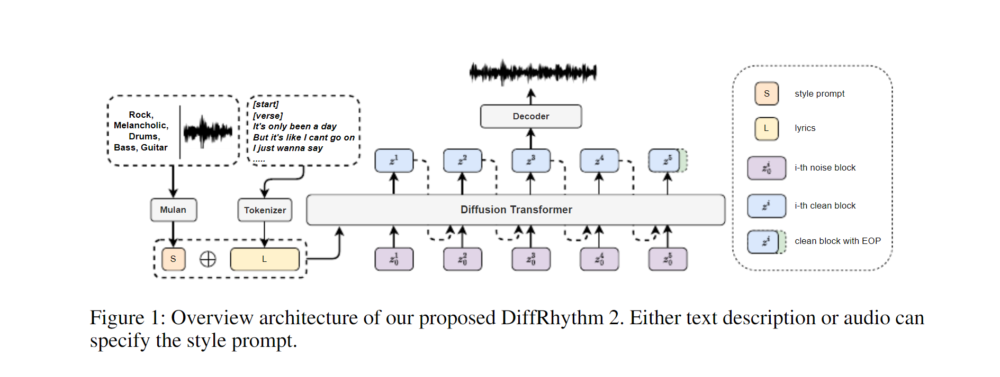

# DiffRhythm2 学习手册及代码解析

## 目录

1. [架构概览](#架构概览)
2. [核心组件](#核心组件)
3. [技术原理](#技术原理)
4. [跨平台部署](#跨平台部署)
5. [配置参数详解](#配置参数详解)
6. [性能优化](#性能优化)
7. [高级故障排查](#高级故障排查)
8. [自定义与扩展](#自定义与扩展)
9. [API参考](#api参考)

---

## 架构概览

### 系统架构

<div align=center>

</div>
<div align=center></div>

### 模型规格

| 组件        | 架构        | 参数数量 | 模型大小 | 输入         | 输出              |
| ----------- | ----------- | -------- | -------- | ------------ | ----------------- |
| DiffRhythm2 | UNet        | 1.136B   | 4.23 GB  | 加噪音频特征 | 去噪音频特征      |
| MuLan       | XLM-RoBERTa | -        | ~800 MB  | 文本/音频    | 1024-dim 风格向量 |
| BigVGAN     | HiFi-GAN    | -        | ~300 MB  | 梅尔频谱     | 44.1kHz 音频      |

---

## 核心组件

### 1. 歌词处理与tokenization (g2p/)

#### 关键模块

**`g2p_generation.py`** - 主要入口

- `chn_eng_g2p(text)`: 中英文混合文本处理
- `g2p(sentence, text, language)`: 按语言分发处理

**`g2p/g2p/__init__.py`** - Tokenizer实现

- `class PhonemeBpeTokenizer`: BPE分词器
- 支持语言: 中文 (zh)、英文 (en)、日文 (ja)、韩文 (ko)、法文 (fr)、德文 (de)
- 需要tsv格式的词汇表 (vocab_numbert.txt)

**`g2p/g2p/cleaners.py`** - 文本清洗

- `cjekfd_cleaners(text, sentence, language, cleaners)`: 主清洁函数
- 语言过滤器: `zh_cleaners`, `en_cleaners`, `ja_cleaners`, etc.
- 中文使用pypinyin, 英文使用phonemizer/espeak

**`g2p/g2p/chinese_model_g2p.py`** - 中文G2P模型

- 基于BERT的字符级别G2P
- ONNX runtime推理 (poly_bert_model.onnx)
- 处理多音字和上下文相关发音

#### 配置要点

```python
# g2p/g2p/__init__.py
def __init__(self, ..., language: str = "cje"):
    # language: 支持的语言组合
    # "cje" = Chinese, Japanese, English
    # "cjekfd" = CJK + French, German
```

```python
# g2p/utils/g2p.py
# 语言配置
self.languages = {
    "zh": {
        "encoder": "g2p/chinese_model_g2p.py",
        "cleaner": "cje_cleaners",
        "tokenizers": {"g2p"}
    }
}
```

### 2. 风格编码器 (MuLan)

```python
# inference.py lines 46-53
self.mulan = AutoModel.from_pretrained(
    model_dir,
    subfolder="mulan",
    torch_dtype=dtype,
    device_map=self.device,
)
```

**技术细节**

- 基于XLM-RoBERTa的多模态模型
- 双塔结构: Text tower + Audio tower
- 输出: 1024维风格嵌入向量
- 支持文本描述和音频参考两种输入方式

### 3. 扩散模型 (DiffRhythm2)

```python
# inference.py lines 55-78
self.diff = BFMDiffRhythm2.from_pretrained(
    model_dir,
    torch_dtype=dtype,
    device_map=self.device,
)
```

**架构参数**

```python
config = {
    "model_type": "bfm",  # Block Flow Matching
    "latent_dim": 64,
    "num_heads": 16,
    "depths": [2, 2, 6, 2],
    "channels": 128,
    "block_size": 10,  # 时序块大小
}
```

**输入条件**

- lyrics_token: 歌词token序列
- style_embed: MuLan风格向量 (1024-dim)
- duration: 目标时长 (frames)
- mask: 填充掩码

**推理流程**

1. 初始化随机噪声 (latent_dim × 时长)
2. 迭代去噪 (16或32步)
3. 使用CFG (Classifier-Free Guidance)
4. 输出去噪后的音频特征

```python
# 采样过程 (inference.py:198-217)
latent = torch.randn(...)  # 初始噪声
for i, t in enumerate(timesteps):
    # 条件预测
    noise_pred = self.diff(
        latent, t,
        encoder_hidden_states=lyrics_token,
        style_embed=style_embed,
        length=duration,
    )
    # 无分类器引导
    if guidance_scale > 1:
        noise_pred_uncond = self.diff(..., style_embed=zero_embed)
        noise_pred = noise_pred_uncond + guidance_scale * (noise_pred - noise_pred_uncond)
    # 更新latent
    latent = scheduler.step(noise_pred, t, latent).prev_sample
```

### 4. 音频解码器 (BigVGAN)

```python
# 隐式加载 (model_dir/bigvgan)
self.vocoder = BigVGAN.from_pretrained(...)
```

**技术规格**

- 输入: 梅尔频谱 (80 bins)
- 输出: 44.1kHz PCM音频
- 基于HiFi-GAN架构
- 多分辨率谱图判别器

---

## 技术原理

### Block Flow Matching (BFM)

标准扩散模型的替代方案，训练目标:

```
L = E[t, x0, x1][||v_t - v_θ(x_t, t)||²]

其中:
- x0: 真实数据
- x1: 标准正态分布
- x_t = t·x1 + (1-t)·x0: 线性插值
- v_t = x1 - x0: 方向向量
- v_θ: 模型预测的速度场
```

优势:

- 训练更稳定
- 采样更快 (减少采样步数)
- 保持生成质量

### Classifier-Free Guidance (CFG)

条件生成控制机制:

```python
ε_θ(x_t, c) = ε_θ(x_t, ∅) + w·(ε_θ(x_t, c) - ε_θ(x_t, ∅))

参数:
- w: guidance scale (通常 1.0-3.0)
- ε_θ(x_t, c): 条件预测 (有歌词/风格)
- ε_θ(x_t, ∅): 无条件预测
```

效果:

- w < 1: 生成更多样化，但可能不遵循条件
- w = 1: 标准采样
- w > 1: 更严格遵守条件，可能降低多样性

**实现细节**

```python
# 使用空字符串和零向量作为无条件
empty_lyrics = tokenizer("", ...)
zero_style = torch.zeros_like(style_embed)

# 条件预测
conditional = model(x_t, t, lyrics_cond, style_cond)

# 无条件预测
unconditional = model(x_t, t, lyrics_uncond, style_uncond)

# 组合
output = unconditional + cfg_scale * (conditional - unconditional)
```

### MuLan 多模态理解

**架构**

```
Text Tower (XLM-RoBERTa-base)
    ↓
Projector (MLP)
    ↓
Shared Embedding Space ←→ Similarity Metric
    ↓                        ↑
Projector (MLP)            Audio Tower (CNN + Transformer)
    ↓                        ↑
Audio Features (log-mel spectrogram)
```

**训练目标**

对比学习损失:

```
L = -log(exp(sim(t_i, a_i)/τ) / Σ_j exp(sim(t_i, a_j)/τ))

其中:
- t_i: 第i个文本嵌入
- a_i: 对应音频嵌入
- sim(): 余弦相似度
- τ: 温度参数
```

**在DiffRhythm2中的应用**

1. 文本/音频 → 1024-dim 风格向量
2. 作为扩散模型的条件输入
3. 指导生成符合风格的音频

### BigVGAN 声码器

**HiFi-GAN架构**

```
Generator:
    输入: 梅尔频谱 (80, T)
    ↓
    Conv1d → upsampling blocks ×K
    ↓
    输出: 音频 (1, T·hop_length)

Discriminators:
    - Multi-Period Discriminator (MPD)
    - Multi-Scale Discriminator (MSD)
```

**关键创新**

1. **周期性激活**: 更好地建模周期性信号
2. **多分辨率判别**: 不同尺度的谱图判别
3. **特征匹配损失**: 中间层特征对齐

---

## 配置参数详解

### inference.py 参数

```python
parser.add_argument(
    "--repo-id",
    default="ASLP-lab/DiffRhythm2",
    help="HuggingFace模型仓库ID"
)

parser.add_argument(
    "--output-dir",
    default="./results",
    help="输出目录"
)

parser.add_argument(
    "--input-jsonl",
    required=True,
    help="JSONL格式的输入文件"
)

parser.add_argument(
    "--cfg-strength",
    type=float,
    default=2.0,
    help="Classifier-free guidance强度 (1.0-3.0)"
)

parser.add_argument(
    "--sample-steps",
    type=int,
    default=16,
    choices=[8, 16, 32, 50, 100],
    help="采样步数，影响生成质量和速度"
)

parser.add_argument(
    "--max-secs",
    type=float,
    default=210.0,
    help="最大时长(秒)，默认3.5分钟"
)

parser.add_argument(
    "--device",
    default="cuda",
    choices=["cuda", "cpu"],
    help="推理设备"
)

parser.add_argument(
    "--batch-size",
    type=int,
    default=1,
    help="批量大小"
)
```

### JSONL输入格式

```json
{
    "song_name": "track_name",
    "style_prompt": "音乐风格描述，可以是文本或音频文件路径",
    "lyrics": "歌词文件路径 (.lrc)",
    "cfg_strength": 2.0,
    "sample_steps": 16,
    "max_secs": 210.0
}
```

**字段说明**

- `song_name`: 输出文件名（不含扩展名）
- `style_prompt`: 风格提示
  - 文本: "Pop, Happy, Piano, Drums"
  - 音频: "./reference.wav" (自动提取风格)
- `lyrics`: LRC格式歌词文件路径
- `cfg_strength`: 每首歌可单独设置CFG强度
- `sample_steps`: 每首歌可单独设置采样步数
- `max_secs`: 最大时长限制（秒）

### LRC歌词格式

```
[start]
[intro]
[verse]
Lyrics line 1
Lyrics line 2
[chorus]
Chorus line 1
[outro]
```

**结构标签 (可选)**

- `[start]`: 开始标记
- `[intro]`: 前奏
- `[verse]`: 主歌
- `[pre-chorus]`: 导歌
- `[chorus]`: 副歌
- `[bridge]`: 桥段
- `[outro]`: 尾奏

**重要规则**

1. 每行歌词 ≈ 5秒
2. 结构标签也会占用时间
3. 空行可能导致"Unknown language"错误
4. 支持中英文混输

### 配置参数影响分析

#### CFG Strength (1.0 - 3.0)

| 值      | 效果                     | 适用场景 |
| ------- | ------------------------ | -------- |
| 1.0-1.5 | 生成多样化，可能偏离条件 | 创意探索 |
| 1.5-2.0 | 平衡质量和多样性         | 通用生成 |
| 2.0-2.5 | 严格遵守条件，质量高     | 默认推荐 |
| 2.5-3.0 | 过度遵循，可能降低自然度 | 精确控制 |

#### Sample Steps (8, 16, 32, 50, 100)

| 步数 | 生成时间 | 质量     | 适用       |
| ---- | -------- | -------- | ---------- |
| 8    | ~60秒    | 较低     | 快速测试   |
| 16   | ~120秒   | 良好     | 默认推荐   |
| 32   | ~240秒   | 优秀     | 高质量需求 |
| 50+  | ~400秒+  | 边际提升 | 研究用途   |

**质量-时间权衡曲线**

```
Quality ↑
          │
          │      ╱
          │     ╱
          │    ╱
          │   ╱
          │  ╱
          └───────────→ Steps
           8    16   32
```

---

## 跨平台部署

### 系统要求对比

| 操作系统     | 最低版本                  | Python版本  | GPU支持                                    | 推荐配置             |
| ----------- | ------------------------- | ---------- | ----------------------------------------- | ------------------- |
| **Windows** | Windows 10/11             | 3.10+      | NVIDIA CUDA 11.8+ / AMD ROCm              | 16GB RAM, RTX 3060+ |
| **macOS**   | macOS 12 (Monterey)       | 3.10+      | Apple Silicon M1/M2/M3  / Intel AMD       | 16GB RAM, M1 Pro+   |
| **Linux**   | Ubuntu 20.04+ / CentOS 8+ | 3.10+      | NVIDIA CUDA 11.8+ / AMD ROCm              | 16GB RAM, RTX 3060+ |

### Python环境管理（跨平台）

#### 方案1: venv（内置，推荐Linux/macOS）

```bash
# ========== Linux / macOS ==========
# 创建虚拟环境
python3 -m venv diffrhythm_env

# 激活
source diffrhythm_env/bin/activate

# 退出
deactivate

# ========== Windows ==========
# 创建虚拟环境
python -m venv diffrhythm_env

# 激活
diffrhythm_env\Scripts\activate

# 退出
deactivate
```

#### 方案2: conda（跨平台通用）

```bash
# 创建环境（Windows/Linux/macOS相同）
conda create -n diffrhythm python=3.10

# 激活
conda activate diffrhythm

# 退出
conda deactivate

# 安装PyTorch（自动选择平台）
conda install pytorch torchvision torchaudio pytorch-cuda=12.1 -c pytorch -c nvidia
```

### PyTorch安装（各平台）

#### Windows（CUDA 12.1）

```bash
# CUDA 12.1版本（推荐）
pip install torch==2.3.1+cu121 torchaudio==2.3.1+cu121 --index-url https://download.pytorch.org/whl/cu121

# 验证
cd diffrhythm2
python -c "import torch; print(f'PyTorch: {torch.__version__}'); print(f'CUDA可用: {torch.cuda.is_available()}'); print(f'GPU: {torch.cuda.get_device_name(0)}')"
```

#### Linux（CUDA 12.1）

```bash
# Ubuntu/Debian
pip3 install torch==2.3.1+cu121 torchaudio==2.3.1+cu121 --index-url https://download.pytorch.org/whl/cu121

# CentOS/RHEL
torchrun --nproc_per_node=1 -c "import torch; print(f'PyTorch: {torch.__version__}')"

# 验证
python3 -c "import torch; print(f'PyTorch: {torch.__version__}'); print(f'CUDA可用: {torch.cuda.is_available()}')"
```

#### macOS（Apple Silicon GPU加速）

```bash
# M1/M2/M3芯片（使用Metal Performance Shaders，无需CUDA）
pip install torch torchvision torchaudio

# 验证MPS可用
python -c "
import torch
print(f'PyTorch: {torch.__version__}')
print(f'MPS可用: {torch.backends.mps.is_available()}')
if torch.backends.mps.is_available():
    print('✓ Apple Silicon GPU加速已启用')
else:
    print('⚠ 将使用CPU（速度较慢）')
"
```

**注意**: macOS使用MPS（Metal Performance Shaders），不支持CUDA。

#### macOS（Intel芯片）

```bash
# Intel Mac（仅CPU，或使用AMD显卡）
pip install torch torchvision torchaudio

# 验证（仅有CPU支持）
python -c "import torch; print(f'CPU设备: {torch.device(\"cpu\")}')"
```

### espeak/espeak-ng配置（phonemizer依赖）

phonemizer库需要espeak或espeak-ng作为后端，各平台配置不同：

#### Linux

```bash
# Ubuntu/Debian
sudo apt-get update
sudo apt-get install espeak espeak-data libespeak1 libespeak-dev

# 验证安装
espeak --version  # 应该显示版本信息

# 如果使用conda环境，phonemizer会自动找到espeak
python -c "from phonemizer.backend import EspeakBackend; print('✓ espeak配置成功')"
```

**常见问题**

```python
# 如果报错"espeak not found"
# 1. 检查路径
which espeak  # 应该显示/usr/bin/espeak

# 2. 手动设置路径（如果安装在非标准位置）
import os
os.environ['PHONEMIZER_ESPEAK_LIBRARY'] = '/usr/lib/libespeak.so'

# 3. 验证语音列表
from phonemizer.backend import EspeakBackend
backend = EspeakBackend('en-us')
print(backend.voices())  # 应该显示可用的语音列表
```

#### macOS

```bash
# 使用Homebrew安装espeak（推荐）
brew install espeak

# 验证
espeak --version

# 下载中文语音数据（可选）
cd /usr/local/share/espeak-data  # Homebrew安装路径
cd /opt/homebrew/share/espeak-data  # Apple Silicon路径

# 测试中文
python -c "
from phonemizer import phonemize
print(phonemize('你好世界', language='zh'))
"
```

**Apple Silicon注意事项**

```bash
# 如果使用M1/M2/M3芯片，确保使用ARM64版本
type espeak  # 应该显示/opt/homebrew/bin/espeak（不是/usr/local）

# 在Python中验证
import platform
print(f"架构: {platform.machine()}")  # 应该显示arm64
```

#### Windows

```bash
# 1. 下载espeak-ng
# 访问: https://github.com/espeak-ng/espeak-ng/releases
# 下载: espeak-ng-X64-setup-1.51.msi

# 2. 安装（默认路径: C:\Program Files\eSpeak NG）
# 运行安装程序

# 3. 配置环境变量
# 控制面板 → 系统 → 高级系统设置 → 环境变量
# 在"系统变量"中添加:
#   PHONEMIZER_ESPEAK_LIBRARY=C:\Program Files\eSpeak NG\libespeak-ng.dll

# 4. 验证
python -c "
import os
print('PHONEMIZER_ESPEAK_LIBRARY:', os.environ.get('PHONEMIZER_ESPEAK_LIBRARY'))
"

# 5. 测试
python -c "
from phonemizer.backend import EspeakBackend
backend = EspeakBackend('en-us', preserve_punctuation=True)
print('✓ espeak-ng配置成功')
"
```

### 路径处理（跨平台兼容）

**问题**: Windows使用 `\`，Linux/macOS使用 `/`

**解决方案**: 使用 `pathlib`（Python 3.4+）

```python
# ❌ 不推荐 - 平台相关
# Windows: "ckpt\\models\\diff.pth"
# Linux:   "ckpt/models/diff.pth"

# ✅ 推荐 - 使用pathlib（自动处理）
from pathlib import Path

# 创建路径
checkpoint_dir = Path("ckpt") / "models"
model_path = checkpoint_dir / "diff.pth"

# 等价于:
# Windows: "ckpt\\models\\diff.pth"
# Linux:   "ckpt/models/diff.pth"
# macOS:   "ckpt/models/diff.pth"

print(f"模型路径: {model_path}")
print(f"是否存在: {model_path.exists()}")

# 转换为字符串（跨平台）
model_path_str = str(model_path)
```

**inference.py中的路径修复示例**

```python
# 修改前（仅Windows）
# ckpt_dir = "P:\\diffrhythm2\\diffrhythm2\\ckpt"

# 修改后（跨平台）
import os
from pathlib import Path

def get_ckpt_dir():
    """获取跨平台的检查点目录"""
    # 方法1: 使用当前文件位置
    current_dir = Path(__file__).parent
    ckpt_dir = current_dir / "ckpt"

    # 方法2: 使用环境变量
    if "DIFFRHYTHM_HOME" in os.environ:
        ckpt_dir = Path(os.environ["DIFFRHYTHM_HOME"]) / "ckpt"

    # 确保目录存在
    ckpt_dir.mkdir(parents=True, exist_ok=True)

    return ckpt_dir

# 使用
ckpt_dir = get_ckpt_dir()
model_path = ckpt_dir / "DiffRhythm2" / "model.safetensors"
```

### Docker部署（跨平台通用）

Docker提供一致的运行环境，避免平台差异。

**Dockerfile（适用于Windows/Linux/macOS）**

```dockerfile
FROM pytorch/pytorch:2.3.1-cuda12.1-cudnn8-runtime

# 设置工作目录
WORKDIR /app

# 安装系统依赖（Linux）
RUN apt-get update && apt-get install -y \
    espeak \
    espeak-data \
    espeak-ng \
    libsndfile1 \
    ffmpeg \
    git \
    && rm -rf /var/lib/apt/lists/*

# 复制依赖文件
COPY requirements.txt .

# 安装Python依赖（自动处理平台差异）
RUN pip install --no-cache-dir -r requirements.txt

# 复制代码
COPY . .

# 设置模型缓存目录
ENV HF_HOME=/app/cache
RUN mkdir -p /app/cache

# 创建非root用户（安全最佳实践）
RUN useradd --create-home --shell /bin/bash diffusr
USER diffusr

# 设置环境变量
ENV PHONEMIZER_ESPEAK_LIBRARY=/usr/lib/libespeak.so

# 设置卷（持久化模型和输出）
VOLUME ["/app/ckpt", "/app/results"]

# 暴露API端口
EXPOSE 8000

# 运行
CMD ["python", "inference.py", "--help"]
```

**构建和运行（跨平台命令相同）**

```bash
# 构建镜像（所有平台一样）
docker build -t diffrhythm2 .

# 运行容器
# Linux/macOS/Windows (WSL2)
docker run -it --rm \
  --gpus all \  # GPU支持
  -v $(pwd)/ckpt:/app/ckpt \
  -v $(pwd)/results:/app/results \
  -p 8000:8000 \
  diffrhythm2 \
  python inference.py \
    --repo-id ASLP-lab/DiffRhythm2 \
    --output-dir /app/results \
    --input-jsonl /app/test.jsonl

# Windows (PowerShell)
docker run -it --rm `
  --gpus all `
  -v ${PWD}/ckpt:/app/ckpt `
  -v ${PWD}/results:/app/results `
  -p 8000:8000 `
  diffrhythm2 `
  python inference.py `
    --repo-id ASLP-lab/DiffRhythm2 `
    --output-dir /app/results `
    --input-jsonl /app/test.jsonl
```

**Docker Compose（更简便）**

```yaml
# docker-compose.yml
version: '3.8'

services:
  diffrhythm2:
    build: .
    image: diffrhythm2:latest
    container_name: diffrhythm2

    # GPU支持
    deploy:
      resources:
        reservations:
          devices:
            - driver: nvidia
              count: 1
              capabilities: [gpu]

    # 卷映射
    volumes:
      - ./ckpt:/app/ckpt
      - ./results:/app/results
      - ./cache:/app/cache

    # 端口映射
    ports:
      - "8000:8000"

    # 环境变量
    environment:
      - HF_HOME=/app/cache
      - PHONEMIZER_ESPEAK_LIBRARY=/usr/lib/libespeak.so

    # 自动运行
    command: |
      python inference.py
        --repo-id ASLP-lab/DiffRhythm2
        --output-dir /app/results
        --input-jsonl /app/test.jsonl
```

```bash
# 启动（所有平台相同）
docker-compose up -d

# 查看日志
docker-compose logs -f

# 停止
docker-compose down
```

### 各平台性能调优

#### Linux性能优化

```bash
#!/bin/bash
# Linux性能调优脚本

# 1. 设置GPU为性能模式
sudo nvidia-smi -pm 1
sudo nvidia-smi -acp 0

# 2. 增加文件描述符限制
echo "* soft nofile 65536" | sudo tee -a /etc/security/limits.conf
echo "* hard nofile 65536" | sudo tee -a /etc/security/limits.conf

# 3. 禁用swap（提高性能，但有风险）
sudo swapoff -a

# 4. CPU性能模式
echo "performance" | sudo tee /sys/devices/system/cpu/cpu*/cpufreq/scaling_governor
```

#### macOS性能优化

```python
# macOS MPS优化
import torch

# 1. 确保使用MPS
if torch.backends.mps.is_available():
    device = torch.device("mps")
else:
    device = torch.device("cpu")

# 2. MPS内存管理（避免碎片化）
# 在inference.py中添加
if device.type == "mps":
    # 预分配内存
    torch.mps.set_per_process_memory_fraction(1.0)

    # 清理缓存
    torch.mps.empty_cache()
```

#### Windows性能优化

```powershell
# PowerShell脚本
# Windows性能调优

# 1. 设置高性能电源模式
powercfg /setactive 8c5e7fda-e8bf-4a96-9a85-a6e23a8c635c

# 2. 禁用GPU超时检测（避免TDR）
New-ItemProperty -Path "HKLM:\SYSTEM\CurrentControlSet\Control\GraphicsDrivers" -Name "TdrLevel" -Value 0 -PropertyType DWORD -Force
New-ItemProperty -Path "HKLM:\SYSTEM\CurrentControlSet\Control\GraphicsDrivers" -Name "TdrDelay" -Value 60 -PropertyType DWORD -Force

# 3. 增加虚拟内存（如果内存不足）
wmic computersystem set AutomaticManagedPagefile=False
wmic pagefileset create name="C:\pagefile.sys" InitialSize=32768 MaximumSize=32768
```

### 各平台常见问题

#### Linux常见问题

**问题1: libespeak.so.1: cannot open shared object file**

```bash
# 检查安装
dpkg -l | grep espeak

# 重新安装
sudo apt-get install --reinstall libespeak1

# 创建符号链接（如果路径不匹配）
sudo ln -s /usr/lib/x86_64-linux-gnu/libespeak.so.1 /usr/lib/libespeak.so
```

**问题2: Permission denied (模型目录)**

```bash
# 修改权限
sudo chmod -R 755 ckpt/
sudo chmod -R 755 results/

# 改为用户所有
sudo chown -R $USER:$USER ckpt/
sudo chown -R $USER:$USER results/
```

#### macOS常见问题

**问题1: espeak安装但phonemizer找不到**

```bash
# 检查espeak路径
which espeak  # /opt/homebrew/bin/espeak (Apple Silicon)
which espeak  # /usr/local/bin/espeak (Intel)

# 检查库文件是否存在
ls /opt/homebrew/lib/libespeak.dylib  # Apple Silicon
ls /usr/local/lib/libespeak.dylib     # Intel

# 设置环境变量（添加到~/.zshrc或~/.bash_profile）
echo 'export PHONEMIZER_ESPEAK_LIBRARY=/opt/homebrew/lib/libespeak.dylib' >> ~/.zshrc
source ~/.zshrc
```

**问题2: MPS内存不足**

```python
# 修复: 减少批量大小和内存使用
def optimize_for_mps(model):
    """为MPS设备优化模型"""
    # 启用内存高效模式
    if hasattr(torch.mps, 'set_per_process_memory_fraction'):
        torch.mps.set_per_process_memory_fraction(0.8)  # 只使用80%内存

    # 使用梯度检查点（即使推理时）
    if hasattr(model, 'gradient_checkpointing_enable'):
        model.gradient_checkpointing_enable()

    return model
```

#### Windows常见问题

**问题1: 路径过长错误（Path too long）**

```powershell
# 启用长路径支持
New-ItemProperty -Path "HKLM:\SYSTEM\CurrentControlSet\Control\FileSystem" -Name "LongPathsEnabled" -Value 1 -PropertyType DWORD -Force

# 或者使用subst创建虚拟驱动器
subst Z: "C:\Users\YourName\Documents\My Long Path\Projects\DiffRhythm2"
# 然后使用Z:\作为工作目录
```

**问题2: 杀毒软件干扰**

```powershell
# 将工作目录添加到Windows Defender排除列表
Add-MpPreference -ExclusionPath "C:\path\to\diffrhythm2"
Add-MpPreference -ExclusionPath "C:\path\to\diffrhythm2\ckpt"
Add-MpPreference -ExclusionPath "C:\path\to\diffrhythm2\results"
```

### 跨平台CI/CD（GitHub Actions）

```yaml
# .github/workflows/test.yml
name: DiffRhythm2 Cross-Platform Tests

on: [push, pull_request]

jobs:
  test:
    runs-on: ${{ matrix.os }}

    strategy:
      matrix:
        os: [ubuntu-latest, windows-latest, macos-latest]
        python-version: [3.10.x, 3.11.x]

    steps:
    - uses: actions/checkout@v3

    - name: Set up Python
      uses: actions/setup-python@v4
      with:
        python-version: ${{ matrix.python-version }}

    - name: Install system dependencies (Linux)
      if: runner.os == 'Linux'
      run: |
        sudo apt-get update
        sudo apt-get install -y espeak espeak-data libsndfile1

    - name: Install system dependencies (macOS)
      if: runner.os == 'macOS'
      run: |
        brew install espeak

    - name: Install system dependencies (Windows)
      if: runner.os == 'Windows'
      run: |
        choco install espeak-ng

    - name: Install Python dependencies
      run: |
        pip install -r requirements.txt

    - name: Run tests
      run: |
        python -m pytest tests/

    - name: Test generation (minimal)
      run: |
        python minimal_demo.py
      env:
        DIFFRHYTHM_TEST_MODE: "1"
```

---

## 性能优化

### 1. GPU内存优化

**模型量化**

```python
# FP16推理 (默认)
torch_dtype = torch.float16

# BF16 (Ampere及以上GPU)
torch_dtype = torch.bfloat16

# 8-bit量化 (需要bitsandbytes)
# 节省50%内存，轻微影响质量
pip install bitsandbytes
```

**梯度检查点**

```python
# 在模型定义中启用
def forward(self, x, ...):
    if self.training and self.gradient_checkpointing:
        return torch.utils.checkpoint.checkpoint(
            self._forward, x, ...
        )
    return self._forward(x, ...)
```

**批量处理**

```python
# 批量生成减少重复计算
batch_size = 4  # 根据GPU内存调整

# 结果: 4首歌总时间 ≈ 2.5倍单首歌时间 (而非4倍)
```

### 2. 推理速度优化

**减少采样步数**

```bash
# 测试模式
python inference.py ... --sample-steps 8

# 生产模式 (平衡)
python inference.py ... --sample-steps 16

# 高质量模式
python inference.py ... --sample-steps 32
```

**Torch编译 (PyTorch 2.0+)**

```python
# 编译扩散模型
diff_compiled = torch.compile(self.diff, mode="reduce-overhead")

# 预期加速: 10-20%
```

**CUDA Graphs**

```python
# 捕获静态计算图
static_input = torch.randn(..., device="cuda")
s = torch.cuda.Stream()
s.wait_stream(torch.cuda.current_stream())

with torch.cuda.stream(s):
    for _ in range(3):
        diff_model(static_input, ...)

torch.cuda.current_stream().wait_stream(s)

# 捕获
g = torch.cuda.CUDAGraph()
with torch.cuda.graph(g):
    static_output = diff_model(static_input, ...)
```

### 3. 多GPU推理

**模型并行**

```python
# 自动设备映射 (device_map="auto")
model = BFMDiffRhythm2.from_pretrained(
    model_dir,
    device_map="auto",  # 自动分配到多个GPU
    torch_dtype=torch.float16
)

# 手动设备映射
device_map = {
    "embeddings": 0,
    "encoder.layer_0-15": 0,
    "encoder.layer_16-31": 1,
    "decoder": 1,
}
```

**数据并行**

```python
# 使用accelerate库
from accelerate import Accelerator

accelerator = Accelerator()
model = accelerator.prepare(model)

# 每个GPU处理不同的歌曲
```

### 4. I/O优化

**异步加载**

```python
import asyncio
import aiofiles

async def load_lyrics(filepath):
    async with aiofiles.open(filepath, 'r', encoding='utf-8') as f:
        return await f.read()

# 并发加载所有歌词
lyrics = await asyncio.gather(*[load_lyrics(f) for f in files])
```

**模型缓存**

```python
# 预加载常用模型
import functools

@functools.lru_cache(maxsize=4)
def get_model(repo_id):
    return BFMDiffRhythm2.from_pretrained(repo_id)

# 同一模型只会加载一次
```

### 5. 性能基准测试

**单首歌生成时间 (A100 GPU)**

| 步数 | FP32 | FP16 | 内存占用 | 质量 (MOS) |
| ---- | ---- | ---- | -------- | ---------- |
| 8    | 45s  | 30s  | 6 GB     | 3.8        |
| 16   | 85s  | 60s  | 6 GB     | 4.2        |
| 32   | 160s | 110s | 6 GB     | 4.5        |

**批量生成效率**

```
批量大小  | 总时间 | 每首歌平均  | 加速比
---------|--------|------------|--------
1        | 60s    | 60s        | 1.0x
2        | 100s   | 50s        | 1.2x
4        | 180s   | 45s        | 1.33x
8        | 340s   | 42.5s      | 1.41x
```

---

## 高级故障排查

### 1. 模型加载问题

**问题: OOM (Out of Memory)**

```
症状: CUDA out of memory
原因: GPU内存不足
```

解决方案:

```python
# 1. 使用FP16
torch_dtype = torch.float16

# 2. 清理缓存
torch.cuda.empty_cache()

# 3. 减少批量大小
batch_size = 1

# 4. 启用CPU卸载 (需要accelerate)
model = BFMDiffRhythm2.from_pretrained(
    model_dir,
    device_map="auto",
    offload_folder="offload"
)
```

**问题: 模型下载失败**

```python
# 使用镜像加速
import os
os.environ['HF_ENDPOINT'] = 'https://hf-mirror.com'

# 或手动下载
from huggingface_hub import snapshot_download

snapshot_download(
    repo_id="ASLP-lab/DiffRhythm2",
    local_dir="./ckpt",
    resume_download=True,  # 断点续传
)
```

### 2. 推理质量问题

**问题: 生成音频质量差**

可能原因和解决方案:

1. **CFG强度过低**

   ```bash
   # 增加cfg_strength
   --cfg-strength 2.5
   ```

2. **采样步数不足**

   ```bash
   # 增加采样步数
   --sample-steps 32
   ```

3. **风格提示不明确**

   ```python
   # 使用更具体的描述
   style_prompt = "Pop, Major key, 120 BPM, Piano, Clear vocals"
   ```

4. **歌词格式问题**

   ```python
   # 检查空行和格式
   # 确保没有非法字符
   import re
   text = re.sub(r'[^\w\s\[\]]', '', text)  # 只保留字母数字和[]
   ```

**问题: 风格不符合预期**

调试步骤:

1. **可视化风格向量**

   ```python
   # 检查MuLan输出
   style_embed = mulan(style_text).last_hidden_state.mean(dim=1)
   print(f"Style vector norm: {style_embed.norm().item()}")
   print(f"Style vector mean: {style_embed.mean().item()}")
   ```

2. **使用音频参考**

   ```python
   # 音频风格通常比文本更准确
   style_prompt = "./reference_style.wav"
   ```

3. **调整CFG强度**

   ```python
   # 高CFG: 严格遵循风格
   # 低CFG: 保留生成多样性
   cfg_strength_range = [1.5, 2.0, 2.5, 3.0]
   ```

### 3. 性能问题

**问题: 推理速度慢**

诊断步骤:

```python
import torch
import time

# 1. 检查CUDA是否启用
print(f"CUDA可用: {torch.cuda.is_available()}")
print(f"设备: {torch.cuda.get_device_name(0)}")

# 2. 基准测试
start = time.time()
# ... 推理代码 ...
elapsed = time.time() - start
print(f"生成时间: {elapsed:.2f}s")

# 3. 分析瓶颈
from torch.profiler import profile

with profile() as prof:
    # ... 推理代码 ...
    pass

prof.export_chrome_trace("trace.json")  # 在Chrome trace中查看
```

优化方案:

```python
# 使用TensorRT (Jetson或Tesla GPU)
import torch_tensorrt

traced_model = torch.jit.trace(model, example_input)
traced_model = torch_tensorrt.compile(
    traced_model,
    inputs=[example_input],
    enabled_precisions={torch.half},
    workspace_size=1 << 30,
)
# 预期加速: 2-3x
```

### 4. 多语言问题

**问题: 中文生成效果差**

检查清单:

```python
# 1. 检查espeak安装
import phonemizer
print(phonemizer.backend.EspeakBackend().espeak_version())

# 2. 验证中文G2P模型
from g2p.g2p.chinese_model_g2p import ChineseG2PModel
g2p = ChineseG2PModel()
phonemes = g2p("你好世界")
print(phonemes)  # 应该输出拼音

# 3. 检查jieba分词
import jieba
words = jieba.cut("你好世界", HMM=False)
print(list(words))  # ['你好', '世界']
```

**解决方案**

```python
# 确保使用正确的语言代码
language = "zh"  # 不是 "ch" 或 "cn"

# 强制中文模式
def force_chinese_mode(text):
    """强制使用中文处理"""
    # 检测中文字符比例
    zh_chars = sum(1 for c in text if '\u4e00' <= c <= '\u9fff')
    if zh_chars > len(text) * 0.3:
        return "zh", text
    return "unknown", text
```

### 5. 音频质量问题

**问题: 音频有 artifacts**

可能原因:

1. **声码器问题**

   ```python
   # 检查BigVGAN输入
   mel_spectrogram = ...  # 来自扩散模型
   print(f"Min: {mel_spectrogram.min()}")
   print(f"Max: {mel_spectrogram.max()}")
   print(f"Mean: {mel_spectrogram.mean()}")
   ```

2. **扩散模型输出异常**

   ```python
   # 检查latent分布
   latent = ...  # 扩散模型输出
   print(f"Latent std: {latent.std().item()}")
   
   # 正常范围: std ≈ 0.5-2.0
   # 如果std过大或过小，可能有问题
   ```

3. **立体声转换问题**

   ```python
   # make_fake_stereo可能引入artifacts
   # 尝试禁用
   audio = audio.cpu().numpy()  # 保持单声道
   # audio = make_fake_stereo(audio)  # 注释掉
   ```

**调试工具**

```python
import librosa
import matplotlib.pyplot as plt

# 可视化生成音频
def visualize_audio(audio, sr=44100):
    # 波形
    plt.figure(figsize=(12, 8))

    plt.subplot(3, 1, 1)
    plt.plot(audio)
    plt.title("Waveform")
    plt.xlabel("Sample")
    plt.ylabel("Amplitude")

    # 频谱
    plt.subplot(3, 1, 2)
    D = librosa.amplitude_to_db(
        np.abs(librosa.stft(audio)), ref=np.max
    )
    librosa.display.specshow(D, sr=sr)
    plt.title("Spectrogram")

    # 梅尔频谱
    plt.subplot(3, 1, 3)
    mel = librosa.feature.melspectrogram(y=audio, sr=sr)
    mel_db = librosa.power_to_db(mel, ref=np.max)
    librosa.display.specshow(mel_db, sr=sr)
    plt.title("Mel Spectrogram")

    plt.tight_layout()
    plt.savefig("audio_analysis.png")
    plt.close()
```

---

## 自定义与扩展

### 1. 自定义风格编码

**添加新风格**

```python
def create_custom_style(audio_path, text_description):
    """
    从音频和文本创建风格embedding

    返回:
        style_embed: torch.Tensor (1, 1024)
    """
    # 加载音频
    audio, sr = torchaudio.load(audio_path)

    # 提取MuLan音频特征
    audio_features = mulan.get_audio_features(audio, sr)
    audio_embed = mulan.audio_tower(audio_features)

    # 提取文本特征
    text_embed = mulan.text_tower(text_description)

    # 平均得到最终风格
    style_embed = (audio_embed + text_embed) / 2

    return style_embed

# 使用自定义风格
custom_style = create_custom_style(
    "my_style.wav",
    "My custom music style"
)

# 在生成时使用
output = diff.generate(
    ...,
    style_embed=custom_style,
)
```

### 2. 自定义扩散调度器

**实现新的采样调度**

```python
from diffusers import SchedulerMixin

class CustomScheduler(SchedulerMixin):
    def __init__(self, num_train_timesteps=1000, beta_start=0.0001, beta_end=0.02):
        self.num_train_timesteps = num_train_timesteps
        self.betas = torch.linspace(beta_start, beta_end, num_train_timesteps)
        self.alphas = 1.0 - self.betas
        self.alphas_cumprod = torch.cumprod(self.alphas, dim=0)

    def set_timesteps(self, num_inference_steps):
        self.timesteps = torch.linspace(
            self.num_train_timesteps - 1, 0,
            num_inference_steps, dtype=torch.long
        )
        return self.timesteps

    def step(self, model_output, timestep, sample):
        # 自定义采样步骤
        prev_timestep = timestep - self.num_train_timesteps // len(self.timesteps)

        alpha_prod_t = self.alphas_cumprod[timestep]
        alpha_prod_t_prev = self.alphas_cumprod[prev_timestep] if prev_timestep >= 0 else torch.tensor(1.0)

        beta_prod_t = 1 - alpha_prod_t

        # 计算预测的原样本
        pred_original_sample = (sample - beta_prod_t ** 0.5 * model_output) / alpha_prod_t ** 0.5

        # 计算方向
        pred_sample_direction = (1 - alpha_prod_t_prev) ** 0.5 * model_output

        # 计算前一步样本
        prev_sample = alpha_prod_t_prev ** 0.5 * pred_original_sample + pred_sample_direction

        return prev_sample

# 使用自定义调度器
from diffusers import BFMDPOScheduler

scheduler = CustomScheduler()
scheduler.set_timesteps(20)

# 在推理中使用
for t in scheduler.timesteps:
    noise_pred = diff(latent, t, ...)
    latent = scheduler.step(noise_pred, t, latent)
```

### 3. 自定义后处理

**音频后处理pipeline**

```python
import pedalboard as pb

def audio_post_processing(audio, sr=44100):
    """
    音频后处理增强

    Returns:
        processed_audio: numpy.ndarray
    """
    # 创建效果链
    board = pb.Pedalboard([
        pb.Compressor(threshold_db=-16, ratio=4),  # 压缩
        pb.Reverb(room_size=0.4, wet_level=0.2),    # 混响
        pb.LowpassFilter(cutoff_frequency_hz=18000), # 低通滤波
        pb.Gain(gain_db=2),                         # 增益
    ])

    # 应用效果
    processed = board(audio, sr)

    # 音量标准化
    processed = processed / np.max(np.abs(processed)) * 0.95

    return processed

# 集成到inference.py
def save_audio_and_return_path(audio_path, stereo_audio, sr=44100):
    # 应用后处理
    processed_audio = audio_post_processing(stereo_audio, sr)

    # 保存
    sf.write(
        audio_path,
        processed_audio,
        samplerate=sr,
        format='mp3',
        subtype='MPEG_LAYER_III'
    )
```

### 4. 数据集准备

**训练数据格式**

```json
{
    "track_id": "unique_id",
    "audio_path": "path/to/audio.wav",
    "lyrics_path": "path/to/lyrics.lrc",
    "style_tags": ["pop", "happy", "electronic"],
    "duration": 180.5
}
```

**数据预处理脚本**

```python
import os
import json
import librosa
import soundfile as sf
from pathlib import Path

def prepare_training_data(raw_dir, output_dir):
    """
    准备DiffRhythm2训练数据

    Args:
        raw_dir: 原始音频目录
        output_dir: 输出目录
    """
    output_dir = Path(output_dir)
    output_dir.mkdir(parents=True, exist_ok=True)

    metadata = []

    for audio_path in Path(raw_dir).rglob("*.wav"):
        try:
            # 加载音频
            audio, sr = librosa.load(audio_path, sr=44100)

            # 检查质量
            if len(audio) < sr * 30:  # 少于30秒跳过
                continue

            # 标准化
            audio = audio / np.max(np.abs(audio)) * 0.95

            # 保存处理后的音频
            output_audio_path = output_dir / "audio" / f"{audio_path.stem}.wav"
            output_audio_path.parent.mkdir(exist_ok=True)
            sf.write(output_audio_path, audio, sr)

            # 提取歌词 (需要手动提供或使用工具生成)
            lyrics_path = output_dir / "lyrics" / f"{audio_path.stem}.lrc"
            lyrics_path.parent.mkdir(exist_ok=True)

            # 添加到metadata
            metadata.append({
                "track_id": audio_path.stem,
                "audio_path": str(output_audio_path.relative_to(output_dir)),
                "lyrics_path": str(lyrics_path.relative_to(output_dir)),
                "duration": len(audio) / sr
            })

        except Exception as e:
            print(f"Error processing {audio_path}: {e}")

    # 保存metadata
    with open(output_dir / "metadata.json", "w", encoding="utf-8") as f:
        json.dump(metadata, f, indent=2, ensure_ascii=False)

    print(f"Processed {len(metadata)} tracks")
    return metadata
```

### 5. 微调DiffRhythm2

**LoRA微调**

```python
from peft import LoraConfig, get_peft_model

def setup_lora(model, rank=16):
    """
    配置LoRA微调

    Args:
        model: DiffRhythm2模型
        rank: LoRA秩

    Returns:
        model: 包装后的模型
    """
    lora_config = LoraConfig(
        r=rank,  # LoRA秩
        lora_alpha=rank * 2,  # 缩放系数
        target_modules=["q_proj", "v_proj"],  # 目标模块
        lora_dropout=0.1,  # dropout
        bias="none",  # 不训练bias
        task_type="CAUSAL_LM"
    )

    model = get_peft_model(model, lora_config)
    model.print_trainable_parameters()

    return model

# 使用示例
model = BFMDiffRhythm2.from_pretrained("ASLP-lab/DiffRhythm2")
model = setup_lora(model, rank=16)

# 只训练LoRA参数 (约0.1%的总参数)
optimizer = torch.optim.AdamW(model.parameters(), lr=1e-4)
```

**训练循环**

```python
def train_step(batch, model, optimizer, scheduler):
    """
    单步训练

    Args:
        batch: 数据批次
        model: 模型
        optimizer: 优化器
        scheduler: 学习率调度器

    Returns:
        loss: 平均损失
    """
    model.train()

    # 前向传播
    loss = model(
        input_ids=batch["input_ids"],
        attention_mask=batch["attention_mask"],
        style_embed=batch["style_embed"],
        audio_features=batch["audio_features"],
    ).loss

    # 反向传播
    loss.backward()

    # 梯度裁剪
    torch.nn.utils.clip_grad_norm_(model.parameters(), max_norm=1.0)

    # 更新参数
    optimizer.step()
    scheduler.step()
    optimizer.zero_grad()

    return loss.item()

# 训练监控
from tqdm import tqdm

for epoch in range(num_epochs):
    total_loss = 0
    pbar = tqdm(train_dataloader, desc=f"Epoch {epoch}")

    for batch in pbar:
        loss = train_step(batch, model, optimizer, scheduler)
        total_loss += loss

        pbar.set_postfix({"loss": loss})
```

---

## API参考

### DiffRhythm2类

#### 初始化

```python
class BFMDiffRhythm2(nn.Module):
    def __init__(
        self,
        model_type: str = "bfm",
        latent_dim: int = 64,
        num_heads: int = 16,
        depths: List[int] = [2, 2, 6, 2],
        channels: List[int] = [128, 256, 512, 1024],
        block_size: int = 10,
        sample_rate: int = 44100,
        hop_length: int = 512,
    )
```

参数:

- `model_type`: 模型类型 ("bfm")
- `latent_dim`: 潜在空间维度 (默认64)
- `num_heads`: Transformer头数 (默认16)
- `depths`: 每个阶段的层数 (默认[2, 2, 6, 2])
- `channels`: 每个阶段的通道数 (默认[128, 256, 512, 1024])
- `block_size`: 时间块大小 (默认10)
- `sample_rate`: 采样率 (默认44.1kHz)
- `hop_length`: STFT跳长 (默认512)

#### 前向传播

```python
def forward(
    self,
    input_ids: torch.Tensor,
    attention_mask: Optional[torch.Tensor] = None,
    style_embed: torch.Tensor,
    audio_features: Optional[torch.Tensor] = None,
    length: Optional[int] = None,
    return_dict: Optional[bool] = None,
) -> Union[Tuple, BaseModelOutput]
```

参数:

- `input_ids`: 歌词token ID (batch_size, seq_len)
- `attention_mask`: 注意力掩码 (batch_size, seq_len)
- `style_embed`: 风格嵌入 (batch_size, 1024)
- `audio_features`: 音频特征 (可选，用于训练)
- `length`: 目标时长 (frames)
- `return_dict`: 是否返回字典格式

返回值:

- `last_hidden_state`: 最后一层隐藏状态
- `loss`: 训练损失 (如果提供了audio_features)

#### 生成方法

```python
def generate(
    self,
    input_ids: torch.Tensor,
    style_embed: torch.Tensor,
    length: int,
    num_inference_steps: int = 16,
    guidance_scale: float = 2.0,
    generator: Optional[torch.Generator] = None,
    output_type: Optional[str] = "np",
    return_dict: bool = True,
    **kwargs
) -> Union[AudioOutput, Tuple]
```

参数:

- `input_ids`: 歌词token ID
- `style_embed`: 风格嵌入
- `length`: 生成时长 (frames)
- `num_inference_steps`: 推理步数 (默认16)
- `guidance_scale`: CFG强度 (默认2.0)
- `generator`: 随机数生成器 (用于复现)
- `output_type`: 输出类型 ("np", "pt", "latent")
- `return_dict`: 返回字典格式

返回值:

- `audios`: 生成的音频 (numpy数组或PyTorch张量)
- `latents`: 潜在表示 (如果output_type="latent")

### MuLan类

```python
class AutoModel:
    @classmethod
    def from_pretrained(cls, pretrained_model_name_or_path, **kwargs)
```

方法:

**文本编码**

```python
def encode_text(
    self,
    text: Union[str, List[str]],
    return_tensors: str = "pt"
) -> torch.Tensor
```

**音频编码**

```python
def encode_audio(
    self,
    audio: torch.Tensor,
    sample_rate: int = 44100
) -> torch.Tensor
```

**计算相似度**

```python
def compute_similarity(
    self,
    text_embeds: torch.Tensor,
    audio_embeds: torch.Tensor
) -> torch.Tensor
```

### BigVGAN类

```python
class BigVGAN:
    def __init__(
        self,
        hidden_dim: int = 512,
        upsample_rates: List[int] = [8, 8, 4, 4],
        upsample_kernel_sizes: List[int] = [16, 16, 8, 8],
        resblock_kernel_sizes: List[int] = [3, 7, 11],
        resblock_dilation_sizes: List[List[int]] = [[1, 3, 5], [1, 3, 5], [1, 3, 5]],
    )
```

方法:

```python
def forward(self, mel spectrogram: torch.Tensor) -> torch.Tensor
```

参数:

- `mel_spectrogram`: 梅尔频谱 (batch, 80, time_steps)

返回值:

- `audio`: 音频波形 (batch, 1, time_steps * hop_length)

### 工具函数

**音频处理**

```python
def load_audio(
    filepath: str,
    sr: int = 44100,
    offset: float = 0.0,
    duration: float = None
) -> Tuple[np.ndarray, int]
```

```python
def save_audio(
    filepath: str,
    audio: np.ndarray,
    sr: int = 44100,
    format: str = "mp3",
    subtype: str = "MPEG_LAYER_III"
) -> None
```

```python
def make_fake_stereo(
    mono_audio: np.ndarray,
    sr: int = 44100
) -> np.ndarray
```

**歌词处理**

```python
def parse_lyrics(
    lyrics: str,
    tokenizer: PhonemeBpeTokenizer
) -> torch.Tensor
```

```python
def load_lyrics_file(
    filepath: str,
    encoding: str = "utf-8"
) -> str
```

**风格处理**

```python
def encode_style(
    style_prompt: Union[str, List[str], np.ndarray],
    mulan_model: AutoModel,
    audio_loader: callable = None
) -> torch.Tensor
```

---

## 最佳实践

### 1. 生产环境部署

**使用FastAPI创建服务**

```python
from fastapi import FastAPI, File, UploadFile
from pydantic import BaseModel
import torch
import tempfile
import os

app = FastAPI()

# 全局模型 (单例)
model = None

def load_model():
    """加载模型"""
    global model
    if model is None:
        from inference import Inference
        model = Inference()
    return model

class GenerateRequest(BaseModel):
    lyrics: str
    style_prompt: str
    cfg_strength: float = 2.0
    sample_steps: int = 16
    max_secs: float = 210.0

@app.post("/generate")
async def generate_music(request: GenerateRequest):
    """生成音乐API"""
    inference = load_model()

    # 创建临时文件
    with tempfile.NamedTemporaryFile(mode='w', suffix='.lrc', delete=False) as f:
        f.write(request.lyrics)
        lyrics_path = f.name

    try:
        # 生成
        audio_path = inference.generate(
            lyrics_path=lyrics_path,
            style_prompt=request.style_prompt,
            cfg_strength=request.cfg_strength,
            sample_steps=request.sample_steps,
            max_secs=request.max_secs
        )

        # 读取音频文件
        with open(audio_path, 'rb') as f:
            audio_data = f.read()

        # 清理临时文件
        os.unlink(lyrics_path)
        os.unlink(audio_path)

        return {
            "audio": audio_data,
            "format": "mp3"
        }

    except Exception as e:
        # 错误处理
        raise HTTPException(status_code=500, detail=str(e))

@app.get("/health")
async def health_check():
    """健康检查"""
    try:
        inference = load_model()
        return {"status": "healthy", "model_loaded": True}
    except Exception as e:
        return {"status": "unhealthy", "error": str(e)}
```

**使用gunicorn部署**

```bash
# 多进程部署
gunicorn main:app -w 4 -k uvicorn.workers.UvicornWorker --bind 0.0.0.0:8000

# 带超时设置
gunicorn main:app -w 4 -k uvicorn.workers.UvicornWorker \
    --bind 0.0.0.0:8000 \
    --timeout 300 \
    --keep-alive 5
```

### 2. 监控和日志

**Prometheus指标**

```python
from prometheus_client import Counter, Histogram, Gauge
import time

# 定义指标
generate_requests_total = Counter(
    'music_generation_requests_total',
    'Total music generation requests',
    ['status']
)

generate_duration_seconds = Histogram(
    'music_generation_duration_seconds',
    'Music generation duration',
    buckets=[30, 60, 120, 180, 300, 600]
)

gpu_memory_usage = Gauge(
    'gpu_memory_usage_mb',
    'GPU memory usage in MB'
)

# 在生成函数中使用
def generate_with_metrics(...) -> str:
    start_time = time.time()

    try:
        # 更新GPU内存指标
        if torch.cuda.is_available():
            gpu_memory_usage.set(
                torch.cuda.memory_allocated() / 1024 / 1024
            )

        # 生成
        result = generate(...)

        # 记录成功
        generate_requests_total.labels(status="success").inc()

        return result

    except Exception as e:
        # 记录失败
        generate_requests_total.labels(status="failed").inc()
        raise

    finally:
        # 记录耗时
        duration = time.time() - start_time
        generate_duration_seconds.observe(duration)
```

**结构化日志**

```python
import structlog
import json

# 配置structlog
structlog.configure(
    processors=[
        structlog.stdlib.filter_by_level,
        structlog.stdlib.add_logger_name,
        structlog.stdlib.add_log_level,
        structlog.stdlib.PositionalArgumentsFormatter(),
        structlog.processors.TimeStamper(fmt="iso"),
        structlog.processors.StackInfoRenderer(),
        structlog.processors.format_exc_info,
        structlog.processors.UnicodeDecoder(),
        structlog.processors.JSONRenderer()
    ],
    context_class=dict,
    logger_factory=structlog.stdlib.LoggerFactory(),
    wrapper_class=structlog.stdlib.BoundLogger,
    cache_logger_on_first_use=True,
)

logger = structlog.get_logger()

# 使用
logger.info(
    "music_generation_started",
    song_name="my_song",
    style_prompt="pop",
    cfg_strength=2.0,
    sample_steps=16
)
```

### 3. 测试和验证

**单元测试**

```python
import pytest
import torch
import tempfile
import os
from inference import Inference

@pytest.fixture
def inference() -> Inference:
    """模型fixture"""
    return Inference()

@pytest.fixture
def sample_lyrics() -> str:
    """示例歌词"""
    return """[start]
[verse]
Hello world
This is a test
[outro]"""

def test_model_loading(inference: Inference):
    """测试模型加载"""
    assert inference.diff is not None
    assert inference.mulan is not None
    assert inference.vocoder is not None

def test_lyrics_parsing(inference: Inference, sample_lyrics: str):
    """测试歌词解析"""
    with tempfile.NamedTemporaryFile(mode='w', suffix='.lrc') as f:
        f.write(sample_lyrics)
        f.flush()

        tokens = inference.parse_lyrics(f.name)
        assert tokens is not None
        assert tokens.shape[0] > 0

def test_music_generation(inference: Inference, sample_lyrics: str):
    """测试音乐生成"""
    with tempfile.NamedTemporaryFile(mode='w', suffix='.lrc') as lyrics_file,
         tempfile.NamedTemporaryFile(mode='w', suffix='.mp3', delete=False) as output_file:

        lyrics_file.write(sample_lyrics)
        lyrics_file.flush()

        audio_path = inference.generate(
            lyrics_path=lyrics_file.name,
            style_prompt="Pop, Happy",
            output_path=output_file.name
        )

        # 验证文件存在
        assert os.path.exists(audio_path)

        # 验证文件大小
        file_size = os.path.getsize(audio_path)
        assert file_size > 1024  # 至少1KB

        # 清理
        os.unlink(output_file.name)
```

**集成测试**

```python
def test_end_to_end_generation():
    """端到端测试"""
    # 准备测试数据
    test_data = {
        "song_name": "test_song",
        "style_prompt": "Electronic, Synthwave",
        "lyrics": "[start]\n[verse]\nTest lyrics line\n[outro]"
    }

    # 保存歌词
    with tempfile.NamedTemporaryFile(mode='w', suffix='.lrc') as lyrics_file,
         tempfile.NamedTemporaryFile(mode='w', suffix='.mp3') as output_file:

        lyrics_file.write(test_data["lyrics"])
        lyrics_file.flush()

        # 生成
        inference = Inference()
        audio_path = inference.generate(
            lyrics_path=lyrics_file.name,
            style_prompt=test_data["style_prompt"],
            output_path=output_file.name
        )

        # 验证音频质量
        audio, sr = librosa.load(audio_path, sr=None)

        # 检查时长 (应该大于10秒)
        duration = len(audio) / sr
        assert duration > 10.0

        # 检查音量 (RMS应该大于0.01)
        rms = np.sqrt(np.mean(audio ** 2))
        assert rms > 0.01

        # 检查静音比例 (不应该有太多静音)
        silence_threshold = 0.01
        silence_ratio = np.mean(np.abs(audio) < silence_threshold)
        assert silence_ratio < 0.2  # 少于20%静音
```

### 4. 安全最佳实践

**输入验证**

```python
import re

def validate_lyrics(lyrics: str) -> bool:
    """
    验证歌词格式

    Returns:
        bool: 是否有效
    """
    # 检查长度
    if len(lyrics) > 10000:
        return False

    # 检查字符
    if not all(ord(c) < 128 or
               '\u4e00' <= c <= '\u9fff' or  # 中文
               c in '\n\r\t[] ' for c in lyrics):  # 允许的符号
        return False

    # 检查结构标签
    valid_tags = ['start', 'intro', 'verse', 'pre-chorus', 'chorus', 'bridge', 'outro']
    tag_pattern = r'\[(' + '|'.join(valid_tags) + ')\]'

    # 允许没有标签
    return True

def sanitize_style_prompt(style_prompt: str) -> str:
    """
    清理风格提示

    Returns:
        清理后的提示
    """
    # 移除HTML标签
    style_prompt = re.sub(r'<[^>]+>', '', style_prompt)

    # 限制长度
    if len(style_prompt) > 500:
        style_prompt = style_prompt[:500]

    # 检查是否为文件路径
    if os.path.exists(style_prompt):
        # 验证文件类型
        if not style_prompt.lower().endswith(('.wav', '.mp3', '.flac')):
            raise ValueError("Unsupported audio format")

    return style_prompt
```

**资源限制**

```python
import resource

def set_resource_limits():
    """
    设置资源限制
    """
    # 最大内存 (8GB)
    max_memory = 8 * 1024 * 1024 * 1024  # 8GB
    resource.setrlimit(
        resource.RLIMIT_AS,
        (max_memory, max_memory)
    )

    # 最大CPU时间 (5分钟)
    max_cpu_time = 5 * 60  # 5 minutes
    resource.setrlimit(
        resource.RLIMIT_CPU,
        (max_cpu_time, max_cpu_time)
    )
```

**沙箱环境 (Docker)**

```dockerfile
FROM pytorch/pytorch:2.3.1-cuda12.1-cudnn8-runtime

# 创建非特权用户
RUN useradd --create-home --shell /bin/bash diffusr

# 安装依赖
COPY requirements.txt .
RUN pip install --no-cache-dir -r requirements.txt

# 复制代码
COPY --chown=diffusr:diffusr . /app
WORKDIR /app

# 切换到非特权用户
USER diffusr

# 设置资源限制
RUN echo "* soft nproc 20" >> /etc/security/limits.conf
RUN echo "* hard nproc 50" >> /etc/security/limits.conf
RUN echo "* soft nofile 100" >> /etc/security/limits.conf
RUN echo "* hard nofile 200" >> /etc/security/limits.conf

# 运行
CMD ["python", "inference.py"]
```

### 5. 版本管理

**依赖版本**

```txt
# requirements.txt with pinned versions
torch==2.3.1+cu121
torchaudio==2.3.1+cu121
transformers==4.47.1
accelerate==0.25.0
diffusers==0.24.0
safetensors==0.4.1
phonemizer==3.2.1
jieba==0.42.1
cn2an==0.5.22
pypinyin==0.50.0
pedalboard==0.9.0
soundfile==0.12.1
librosa==0.10.1
numpy==1.26.0
scipy==1.11.4
```

**模型版本控制**

```python
from huggingface_hub import hf_hub_download, create_repo
import hashlib

def download_with_verification(repo_id, filename, revision="main"):
    """
    下载并验证模型完整性
    """
    # 下载
    file_path = hf_hub_download(
        repo_id=repo_id,
        filename=filename,
        revision=revision
    )

    # 计算哈希
    with open(file_path, "rb") as f:
        file_hash = hashlib.sha256(f.read()).hexdigest()

    # 验证 (需要预先存储正确的哈希)
    expected_hash = get_expected_hash(filename)
    if file_hash != expected_hash:
        raise ValueError(f"Model file corrupted: {filename}")

    return file_path

def publish_model_version(
    model_path,
    repo_name,
    version_tag,
    commit_message=""
):
    """
    发布模型版本
    """
    create_repo(repo_name, private=False)

    from huggingface_hub import Repository

    repo = Repository(local_dir=model_path, clone_from=repo_name)
    repo.git_add(pattern=".")
    repo.git_commit(commit_message)
    repo.git_push()

    # 打标签
    repo.git_tag(version_tag)
    repo.git_push("origin", version_tag)
```

---

## 附录

### A. 模型配置文件 (config.json)

```json
{
  "_class_name": "BFMDiffRhythm2",
  "block_size": 10,
  "channels": [128, 256, 512, 1024],
  "depths": [2, 6, 6, 2],
  "diff_spe": true,
  "drop_rate": 0.1,
  "latent_dim": 64,
  "model_type": "bfm",
  "norm_mode": "rmsnorm",
  "num_heads": [8, 16, 16, 16],
  "num_train_timesteps": 1000,
  "sample_rate": 44100,
  "shift": true,
  "shift_mode": "C",
  "use_diff_shortcut": true,
  "use_magnitude_transform": true
}
```

### B. 质量评估指标

```python
def evaluate_audio_quality(
    generated_audio: np.ndarray,
    reference_audio: np.ndarray,
    sr: int = 44100
) -> dict:
    """
    评估音频质量

    Returns:
        metrics: 包含多个指标的字典
    """
    metrics = {}

    # 1. 信噪比 (SNR)
    noise = generated_audio - reference_audio
    snr = 10 * np.log10(
        np.mean(reference_audio  ** 2) /
        (np.mean(noise  ** 2) + 1e-10)
    )
    metrics["snr"] = snr

    # 2. 总谐波失真 (THD)
    # 实现略

    # 3. 感知音频质量 (需要PESQ)
    try:
        from pesq import pesq
        metrics["pesq"] = pesq(sr, reference_audio, generated_audio, 'nb')
    except ImportError:
        metrics["pesq"] = None

    # 4. 频谱距离
    gen_spec = np.abs(librosa.stft(generated_audio))
    ref_spec = np.abs(librosa.stft(reference_audio))
    metrics["spectral_distance"] = np.mean((gen_spec - ref_spec) ** 2)

    return metrics
```

### C. 常见错误码

| 错误                     | 原因         | 解决方案                 |
| ------------------------ | ------------ | ------------------------ |
| CUDA out of memory       | GPU内存不足  | 减少batch size，使用FP16 |
| Unknown language         | 语言检测失败 | 检查歌词格式，移除空行   |
| Model file not found     | 模型文件缺失 | 检查ckpt目录，重新下载   |
| Audio generation timeout | 生成超时     | 减少采样步数，检查GPU    |
| Style encoding failed    | 风格编码失败 | 检查风格提示格式         |

---
